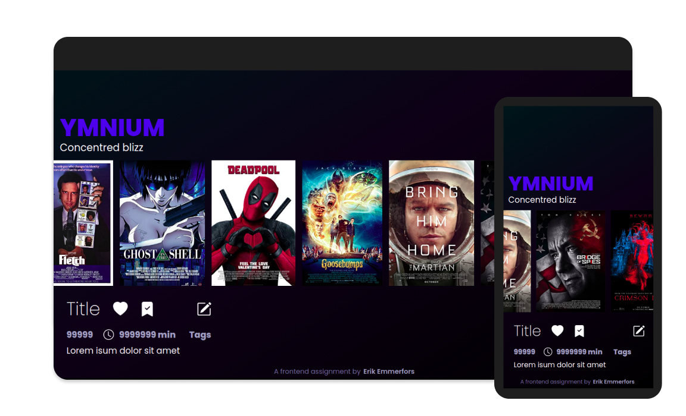

<br />
<p align="center">
  <a href="https://gitlab.com/psilore/ymnium">
    
  </a>

  <h3 align="center">Ymnium</h3>
  <p align="center">A Frontend assignment for Omegapoint.</p>
  <p align="center">By Erik Emmerfors.</p>
  <br />
  <br />
   
</p>


## CI

|Production|URL|
|:----|:----|
|[](https://app.netlify.com/sites/velvety-concha-b693a3/deploys)|https://6291f9e8dd6ddf0008eb7e0b--velvety-concha-b693a3.netlify.app/.netlify/functions/start|

## Prerequisites

1. Requires node.js.

**NOTE!** This application utilizes and consume an OMDb API endpoint.

Apply for an API Key, link to OMDb and get a API Key, [https://www.omdbapi.com/apikey.aspx](https://www.omdbapi.com/apikey.aspx)


## Installation

1. Clone the repo

```sh
git clone https://gitlab.com/psilore/ymnium.git
```

2. Change to `ymnium` directory

```sh
cd ymnium/
```

3. Install NPM packages

```sh
npm install
```


## Develop

### Start Ymnium and watch for changes on [http://localhost:8080](http://localhost:8080)

```sh
$ npm run start

> ymnium@1.0.0 start /path/to/dir
> node ./src/app.js

Ymnium is listening on http://localhost:8080
```

## Problem

Your interest in movies has made you consume them to an exaggerated degree, which also have lead to an extensivly hoarding of physical DVDs and blueray discs. In order to combat this problem, you decided to make a register over all these movies. That may will make it easier to search and keep track of your movies in the library.

## Tasks

- Create a user interface to show a list of all the movies
- For every entry in `movies.xml`, there should be a possibillity to get more details about the movies
- To be able to edit the meta data for each entry `movies.xml`, being able to write to the XML document
- Show the poster/cover from each movie in `movies.xml`, I.E fetched from an external API, e.g OMDb API or similar

## Resources

Download `movies.xml` from [https://goo.gl/KFKdh4](https://goo.gl/KFKdh4)

**NOTE!** For security reasons I have added the un shortned URL, content of link: `https://goo.gl/KFKdh4` it basically points directly to a dropbox bucket with a xml file, I.E `movies.xml`. Looks harmless.


Absolute, unshortened URL:

```script
https://uc21f2ce468c6e72848c95600297.dl.dropboxusercontent.com/cd/0/get/BWS3zV1Slyhyr0mn9tLkb_08eYq7f-joYsF5777CNQbCPWPnb_pWK6skL67urYqNQl5PMB5HZ51xW5XxZ6FH33fJhMhoht86gl6Q4LaCxdubdGqnyGAdiRS_Bo4SfzSPvkGSn_sUGboQC_19X6gkor0V/file?dl=1#
```

